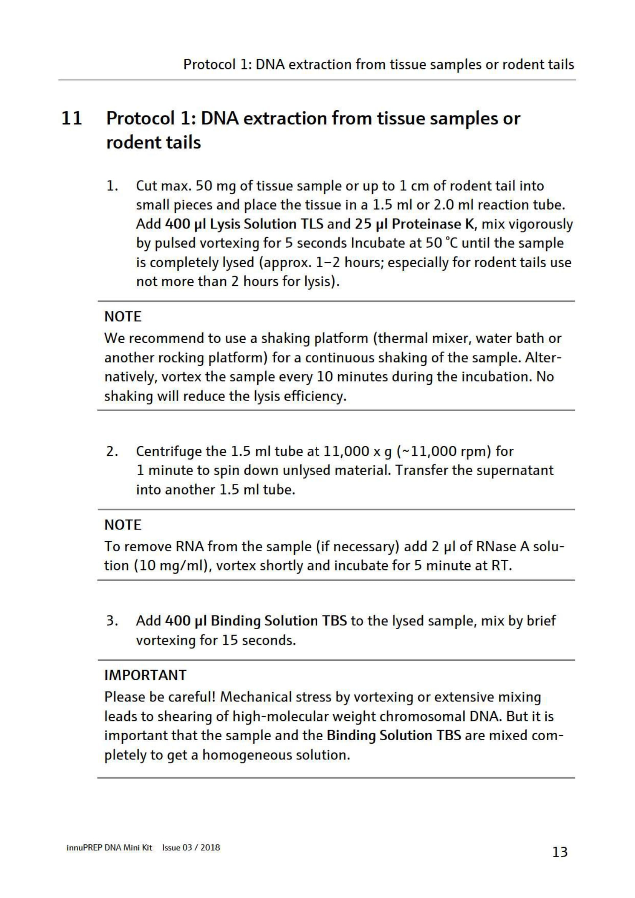
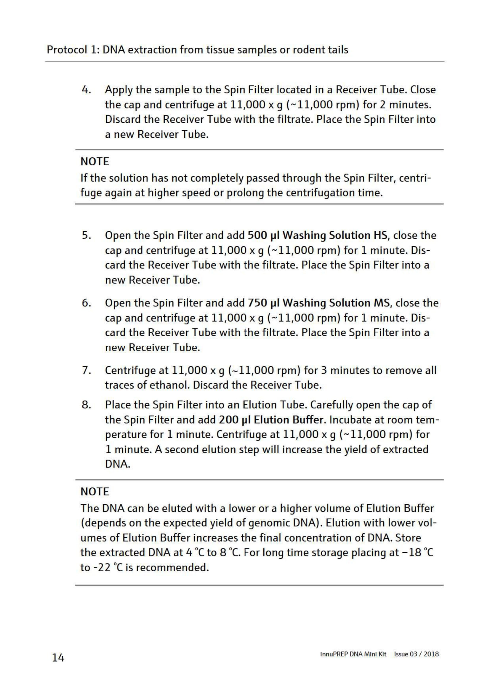

**12 samples maximum**

### before starting turn on the incubator (with shaking function) 
1. Take sample out of the tube and put it in a medium sized mortar 
2. Pour liquid nitrogen on top to cover it and wait until the liquid nitrogen evaporates (wear glasses) 
3. crush the sample with the mortar 
4. Split the crushed sample into **two** 1,5 ml tubes with lid (up to 50 mg sample each) and store them at -80°C (for caecum: 1.DNA extraction, 2. RNA extraction) 

### Extraction steps:
5. Add 400 µl Lysis solution TLS and 25 µl Proteinase K. Vortex for 5s 
6. Incubate at 50°C until the sample is lysed (1 hour for caecum) (during this time prepare a set of tubes, pipette the binding solution already) 
7. Centrifuge at 11.000 x g for 1 min and transfer the supernatant into another 1,5 ml tube with lid 
8. Add 400 µl Binding solution TBS and vortex for 15 s 
9. Apply the sample to spin filter located in a tube without lid and centrifuge for 2 min at 11.000 x g 
10. Place spin filter into new tube without lid; flow through and old tube can be discarded (If the solution (400-500 µł / almost 800 µł) has not completely past through centrifuge again) 
11. Add 500 µł Washing solution HS and centrifuge at 11.000 x g for 1 min (4 min). Discard flowthrough and tube put spin filter into new tube without lid 
12. Add 750 µl Washing solution MS and centrifuge at 11.000 x g for 1 min. Discard flowthrough 
13. Centrifuge for 3 min at 11.000 x g to dry filter. Discard tube afterwards 
14. Put filter onto a tube with lid and add 200 µl Elution buffer. Centrifuge for 1 min at 11.000 xg (second elution step will increase the yield of extracted DNA)

