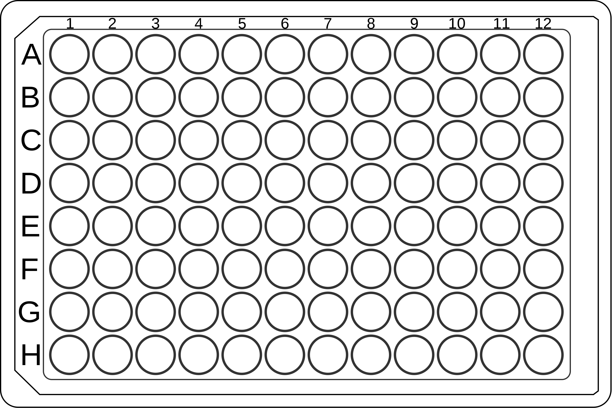

```{r setup, include=FALSE}
knitr::opts_chunk$set(echo = TRUE)
```

## Quantitative real-time PCR for faecal samples
#### Measuring amount of DNA with NanoDrop
* Switch on the PC next to nanodrop
* Log in the program of NanoDrop
* Add 1 µL of the solution, in which your DNA is diluted and blank
* Write the sample name 
* Add 1 µL of your sample and measure
* Save them on a usb stick

#### Standardizing the samples:
* Easy way: Use this webbsite to calculate the sample dilutions
  * http://www.desiquintans.com/dilutioncalc
* Add the desired final volume
* In this case: 50 ng of DNA 
* 10 ng per µL (5 µL of sample = 50 ng of DNA)

#### Eimeria specific primers: 
Prepare the primers and make aliquots
1. Eim_COI_qX_F 5’-TGTCTATTCACTTGGGCTATTGT-3’ 
2. Eim_COI_qX_R 5’-GGA TCACCGTTAAATGAGGCA-3’

### Each reaction contains: (20 µL)

* 1X iTaqTM Universal SYBRⓇ Green Supermix (Bio-Rad, USA)
* 400 nM forward and reverse primers 
* 50 ng template gDNA 

#### Steps qPCR:

* Take out the samples /primers from the freezer and put them on ice
* Prepare the layout of your plate 
* for every sample we have triplicates and a negative control per plate, which contains all the reagents without DNA (Water, SYBR and primers)
* set up the plate and the run before you start on: https://apps.thermofisher.com/

{height=200px width=300px}

#### Recipe for one Reaction: (20 µL per well)
1. SYBR: 10 µL 
2. Forward primer: 0.8 µL 
3. Reverse primer: 0.8 µL 
4. H20: 7.4 µL 
5. DNA: 1 µL of standardized 50 ng template gDNA

#### Master master mix: Prepare in Eppendorf Tubes
n = sample + negative control number 
```{r}
n = 13
STBR = 10 * 4 * n
cat("STBR = ", STBR,"µL")
FP = 0.8 * 4 * n
cat("Forward Primer = ", FP,"µL")
RP = 0.8 * 4 * n
cat("Reverse Primer = ", RP,"µL")
H20 = 7.4 * 4 * n
cat("H20 = ", H20,"µL")
```

#### Master mix: Prepare in epis or strips
* 76 µL MMM + 4 µL DNA template
* Use a plate cooler with your plate
* Finally pipette 20 µL in each well of the 96 plate for the reaction
* File saved as: qPCR_eimeria_field_faeces______________________________________.eds in the thermofisher cloud

### PCR machine:
* either in the ABI7300 Real-Time PCR system (Applied Biosystems, USA)
* or in a MasterCycler® RealPlex2 (Eppendorf, Germany) 
* or in in the CFX96TM Touch System (Bio-Rad, USA) 
* QuantStudio 1 (Thermofisher)

### Material used:
DNAs from mock samples, floated oocysts and faecal DNA derived from the infection experiment

### Cycling conditions:
Arrange the plate begore in Thermofischer.com
Design Analysis new --> set up plate --> comparative cd - SYBR

1. initial denaturation at **95°C** for **2 min**
2. **40 cycles** of denaturation at **95°C** for **15 s**
3. annealing at **55 °C** for **15 s** 
4. and extension at **68°** for **20 s** 

(with data collection at the end of each cycle)

### Melting curve anaylsis:

Melting curve analysis was included to discard primer dimer formation and non-specific amplification: after the last amplification cycle temperature was increased from 65 °C to 95 °C with 0.5 °C increments at 3 s/step

### Positioning on the plate
Amplifications were performed by triplicate and each run included a non-template control (NTC). 

### Analysis and interpretation

Samples with all three replicates showing Tm (Melting curve temperature) in the range 74.1 ± 1.78 °C (observed on positive controls, Additional file 2: Figure S1) were labelled as “qPCR positive”, samples with only one or two of the triplicates showing peaks were designated as negative samples.


For qPCR negative samples, genome copies per gram of faeces were set to 0.  ict genome equivalents from Ct. 


